<h2>
EfficientDet-Japanese-Signals (Updated: 2022/04/26)
</h2>

This is an experimental project to train and detect Pedestrian and Traffic Signals in Japan based on 
<a href="https://github.com/google/automl/tree/master/efficientdet">Google Brain AutoML efficientdet</a>.
 

<h3>
1. Installing tensorflow on Windows10
</h3>
We use Python 3.8.10 to run tensoflow 2.4.2 on Windows10. 
At first, please install <a href="https://visualstudio.microsoft.com/ja/vs/community/">Microsoft Visual Studio Community</a>, which can be used to compile source code of 
<a href="https://github.com/cocodataset/cocoapi">cocoapi</a> for PythonAPI. 
Subsequently, please create a working folder "c:\google" folder for your repository, and install the python packages. 

<pre>
>mkdir c:\google
>cd    c:\google
>pip install -r requirements.txt
>git clone https://github.com/cocodataset/cocoapi
>cd cocoapi/PythonAPI
</pre>
You have to modify extra_compiler_args in setup.py in the following way: 
   extra_compile_args=[],
<pre>
>python setup.py build_ext install
</pre>

 
 
<h3>
2. Installing EfficientDet-Japanese-Signals
</h3>
Please clone EfficientDet-Japanese-Signals in the working folder <b>c:\google</b>. 
<pre>
>git clone https://github.com/atlan-antillia/EfficientDet-Japanese-Signals.git 
</pre>
You can see the following folder <b>projects</b> in  EfficientDet-Japanese-Signals folder of the working folder. 

<pre>
EfficientDet-Japanese-Signals
└─projects
    └─Signals
        ├─saved_model
        │  └─variables
        ├─test_dataset
        ├─test_dataset_outputs
        ├─train
        └─valid
</pre>
 

<h3>3. Inspect tfrecord</h3>
  You can use <a href="https://github.com/sarah-antillia/TFRecordInspector">TFRecordInspector</a> to inspect train and valid tfrecods. 
Run the following command to inspect train.tfreord. 
<pre>
>python TFRecordInspector.py ./projects/Signals/train/train.tfrecord ./projects/Signals/label_map.pbtxt ./inspector/train
</pre>
  
This will generate annotated images with bboxes and labels from the tfrecord, and cout the number of annotated objects in it. 
 
<b>TFRecordInspecotr: annotated images in train.tfrecord</b> 
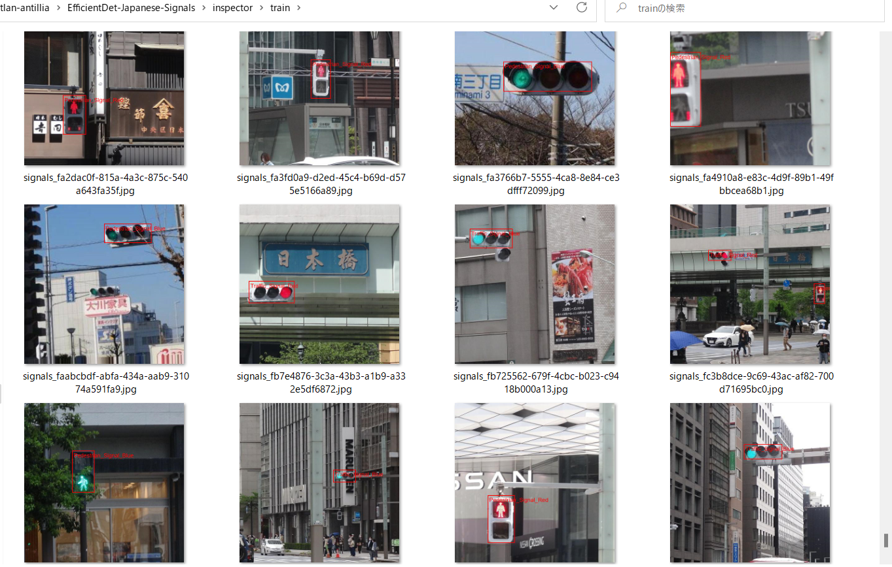
 
 
<b>TFRecordInspecotr: objects_count train.tfrecord</b> 
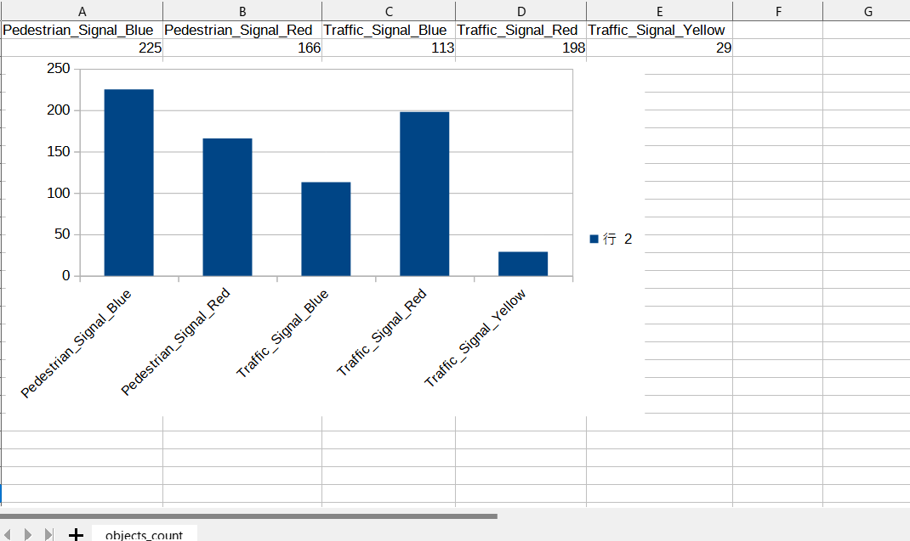
 
This bar graph shows that the number of the objects contained in train.tfrecord.
 
 
 
<h3>4. Downloading the pretrained-model efficientdet-d0</h3>
Please download an EfficientDet model chekcpoint file <b>efficientdet-d0.tar.gz</b>, and expand it in <b>EfficientDet-Japanese-Signals</b> folder. 
 
https://storage.googleapis.com/cloud-tpu-checkpoints/efficientdet/coco2/efficientdet-d0.tar.gz
 
See: https://github.com/google/automl/tree/master/efficientdet 

<h3>5. Training Japanese Signals Model by using pretrained-model</h3>
We use the Signals_train.bat file.
We created a main2.py from main.py to be able to write COCO metrics to a csv files. 

<pre>
python main2.py ^
  --mode=train_and_eval ^
  --train_file_pattern=./projects/Signals/train/*.tfrecord  ^
  --val_file_pattern=./projects/Signals/valid/*.tfrecord ^
  --model_name=efficientdet-d0 ^
  --hparams="input_rand_hflip=False,num_classes=5,label_map=./projects/Signals/label_map.yaml" ^
  --model_dir=./projects/Signals/models ^
  --label_map_pbtxt=./projects/Signals/label_map.pbtxt ^
  --eval_dir=./projects/Signals/eval ^
  --ckpt=efficientdet-d0  ^
  --train_batch_size=4 ^
  --early_stopping=map ^
  --patience=10 ^
  --eval_batch_size=1 ^
  --eval_samples=200  ^
  --num_examples_per_epoch=400 ^
  --num_epochs=100
</pre>

<table style="border: 1px solid #000;">
<tr>
<td>
--mode</td><td>train_and_eval</td>
</tr>
<tr>
<td>
--train_file_pattern</td><td>./projects/Signals/train/*.tfrecord</td>
</tr>
<tr>
<td>
--val_file_pattern</td><td>./projects/Signals/valid/*.tfrecord</td>
</tr>
<tr>
<td>
--model_name</td><td>efficientdet-d0</td>
</tr>
<tr><td>
--hparams</td><td>"input_rand_hflip=False,num_classes=5,label_map=./projects/Signals/label_map.yaml"
</td></tr>
<tr>
<td>
--model_dir</td><td>./projects/Signals/models</td>
</tr>
<tr><td>
--label_map_pbtxt</td><td>./projects/Signals/label_map.pbtxt
</td></tr>

<tr><td>
--eval_dir</td><td>./projects/Signals/eval
</td></tr>

<tr>
<td>
--ckpt</td><td>efficientdet-d0</td>
</tr>
<tr>
<td>
--train_batch_size</td><td>4</td>
</tr>
<tr>
<td>
--early_stopping</td><td>map</td>
</tr>
<tr>
<td>
--patience</td><td>10</td>
</tr>

<tr>
<td>
--eval_batch_size</td><td>1</td>
</tr>
<tr>
<td>
--eval_samples</td><td>200</td>
</tr>
<tr>
<td>
--num_examples_per_epoch</td><td>400</td>
</tr>
<tr>
<td>
--num_epochs</td><td>100</td>
</tr>
</table>
 
 
<b>label_map.yaml</b>
<pre>
1: 'Pedestrian_Signal_Blue'
2: 'Pedestrian_Signal_Red'
3: 'Traffic_Signal_Blue'
4: 'Traffic_Signal_Red'
5: 'Traffic_Signal_Yellow'
</pre>
 
 
 
<b>COCO meticss f and map</b> 
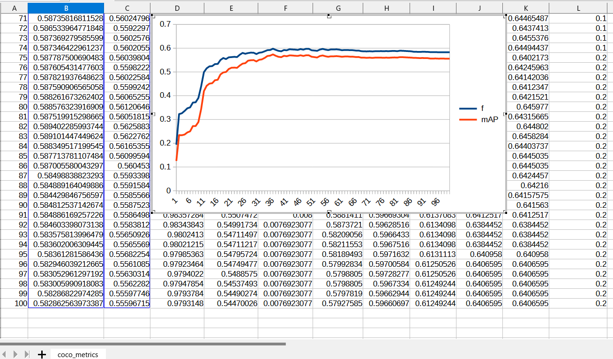
 
 
<b>Train losses at epoch</b> 
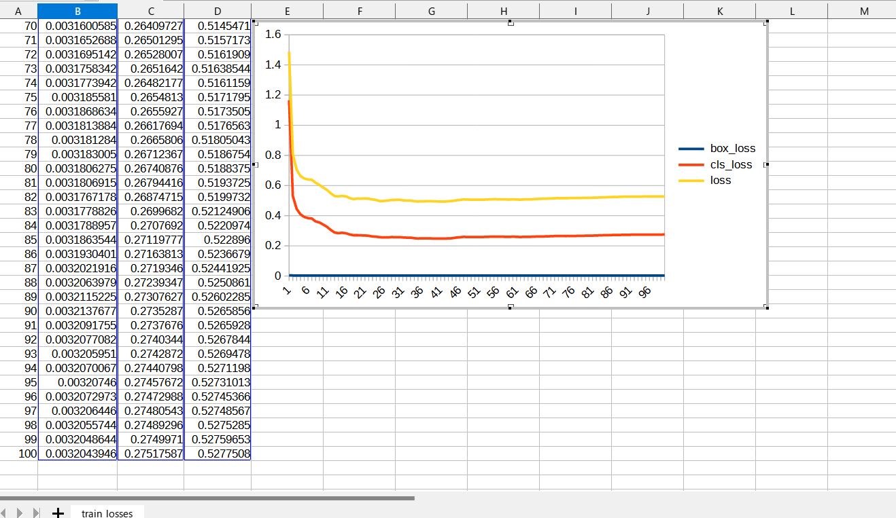
 
 
<!--
<b>COCO ap per class at epoch</b> 

 
 
 
-->
<h3>
6. Create a saved_model from the checkpoint
</h3>
 We use the following Signals_create_saved_model.bat file.
<pre>
python model_inspect.py ^
  --runmode=saved_model ^
  --model_name=efficientdet-d0 ^
  --ckpt_path=./projects/Signals/models  ^
  --hparams="image_size=512x512,num_classes=5" ^
  --saved_model_dir=./projects/Signals/saved_model
 
</pre>

<table style="border: 1px solid #000;">
<tr>
<td>--runmode</td><td>saved_model</td>
</tr>

<tr>
<td>--model_name </td><td>efficientdet-d0 </td>
</tr>

<tr>
<td>--ckpt_path</td><td>./projects/Signals/models</td>
</tr>

<tr>
<td>--hparams</td><td>"image_size=512x512,num_classes=5"</td>
</tr>

<tr>
<td>--saved_model_dir</td><td>./projects/Signals/saved_model</td>
</tr>
</table>

 
 
<h3>
7. Detect Signals by using a saved_model
</h3>
 We use the following signals_detect.bat file.
<pre>
python model_inspect.py ^
  --runmode=saved_model_infer ^
  --model_name=efficientdet-d0 ^
  --saved_model_dir=./projects/Signals/saved_model ^
  --min_score_thresh=0.3 ^
  --hparams="num_classes=5,label_map=./projects/Signals/label_map.yaml" ^
  --input_image=./projects/Signals/test_dataset/*.jpg ^
  --output_image_dir=./projects/Signals/test_dataset_outputs
</pre>

<table style="border: 1px solid #000;">
<tr>
<td>--runmode</td><td>saved_model_infer </td>
</tr>

<tr>
<td>--model_name</td><td>efficientdet-d0 </td>
</tr>

<tr>
<td>--saved_model_dir</td><td>./projects/Signals/saved_model </td>
</tr>

<tr>
<td>--min_score_thresh</td><td>0.3 </td>
</tr>

<tr>
<td>--hparams</td><td>"num_classes=160,label_map=./projects/Signals/label_map.yaml"</td>
</tr>

<tr>
<td>--input_image</td><td>./projects/Signals/Signals_test_dataset_160classes/*.jpg</td>
</tr>

<tr>
<td>--output_image_dir</td><td>./projects/Signals/Signals_test_dataset_160classes_outputs</td>
</tr>
</table>
 
<h3>
8. Some detection results of Japanese Signals
</h3>

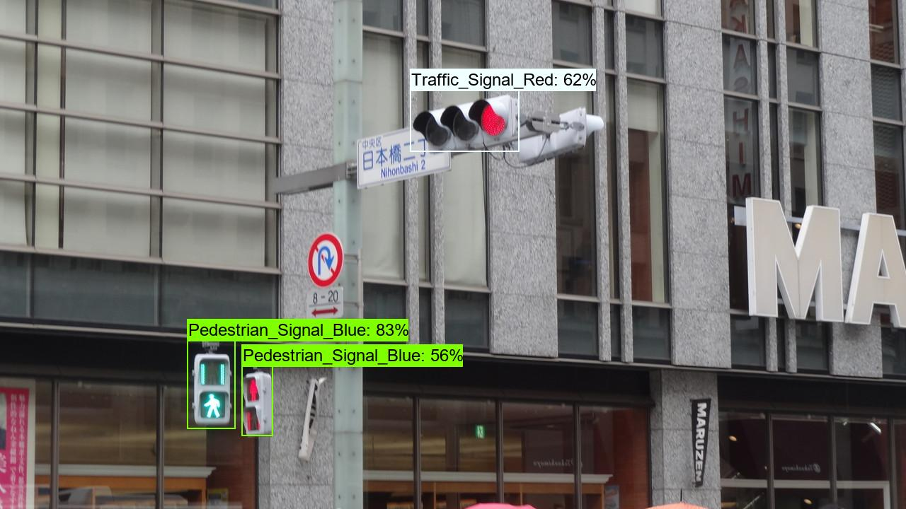 
<a href="./projects/Signals/test_dataset_outputs/signals_1041.jpg_objects.csv">roadsigns1001.jpg_objects.csv</a> 
 
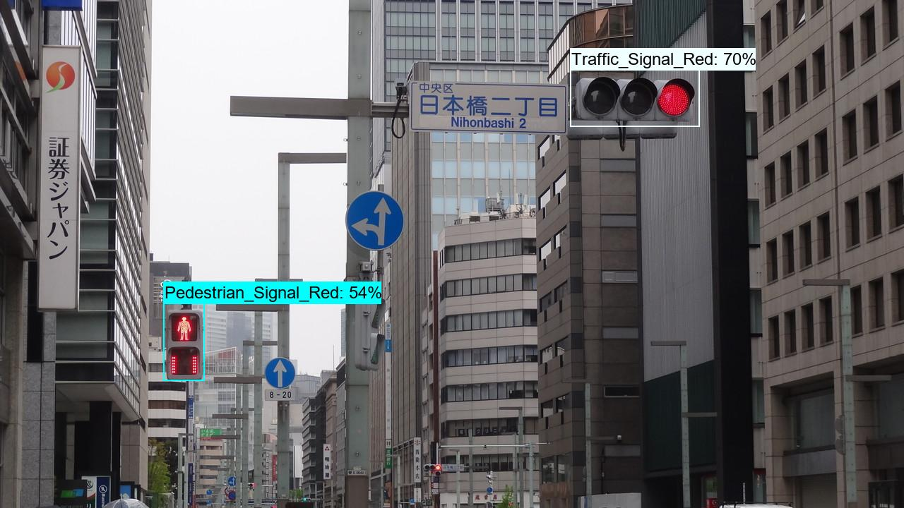 
<a  href="./projects/Signals/test_dataset_outputs/signals_1042.jpg_objects.csv">roadsigns1002.jpg_objects.csv</a> 
 
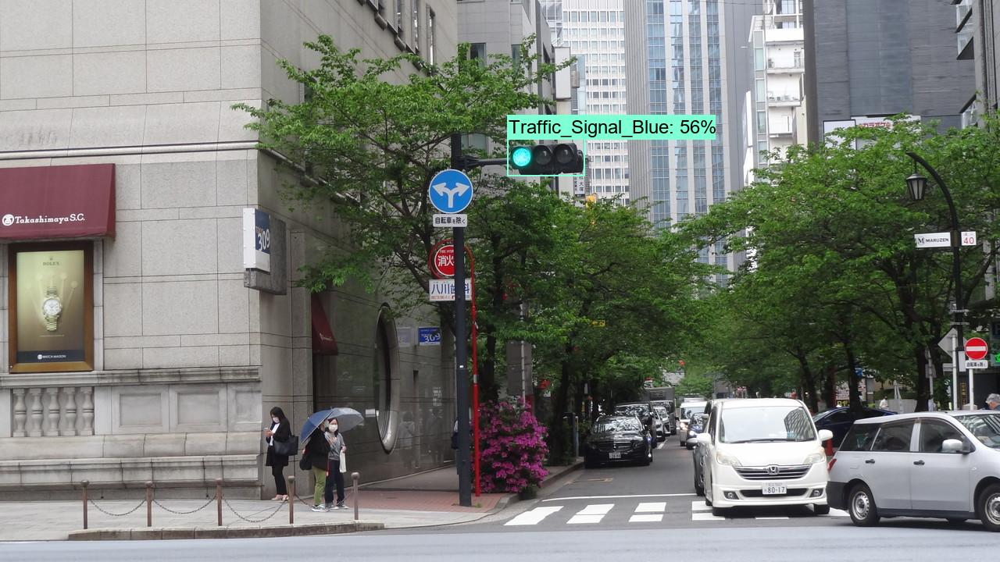 
<a  href="./projects/Signals/test_dataset_outputs/signals_1043.jpg_objects.csv">roadsigns1003.jpg_objects.csv</a> 
 
 
<a  href="./projects/Signals/test_dataset_outputs/signals_1044.jpg_objects.csv">roadsigns1004.jpg_objects.csv</a> 
 
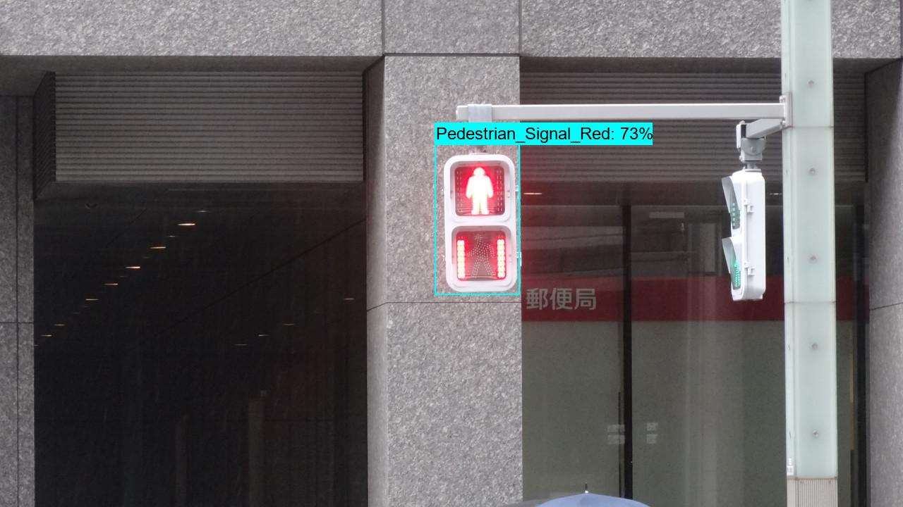 
<a  href="./projects/Signals/test_dataset_outputs/signals_1045.jpg_objects.csv">roadsigns1005.jpg_objects.csv</a> 
 
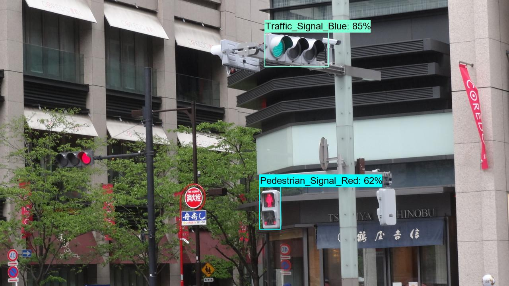 
<a  href="./projects/Signals/test_dataset_outputs/signals_1046.jpg_objects.csv">roadsigns1006.jpg_objects.csv</a> 
 
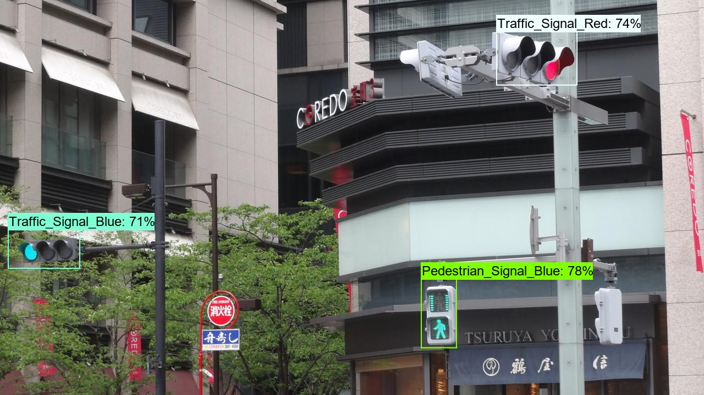 
<a  href="./projects/Signals/test_dataset_outputs/signals_1047.jpg_objects.csv">roadsigns1007.jpg_objects.csv</a> 
 
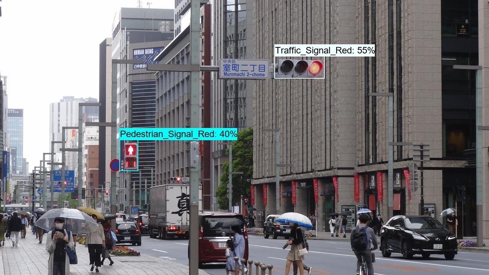 
<a  href="./projects/Signals/test_dataset_outputs/signals_1048.jpg_objects.csv">roadsigns1008.jpg_objects.csv</a> 
 
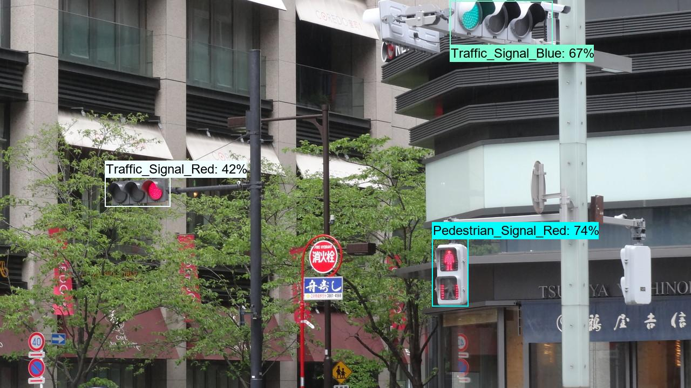 
<a  href="./projects/Signals/test_dataset_outputs/signals_1049.jpg_objects.csv">roadsigns1009.jpg_objects.csv</a> 
 
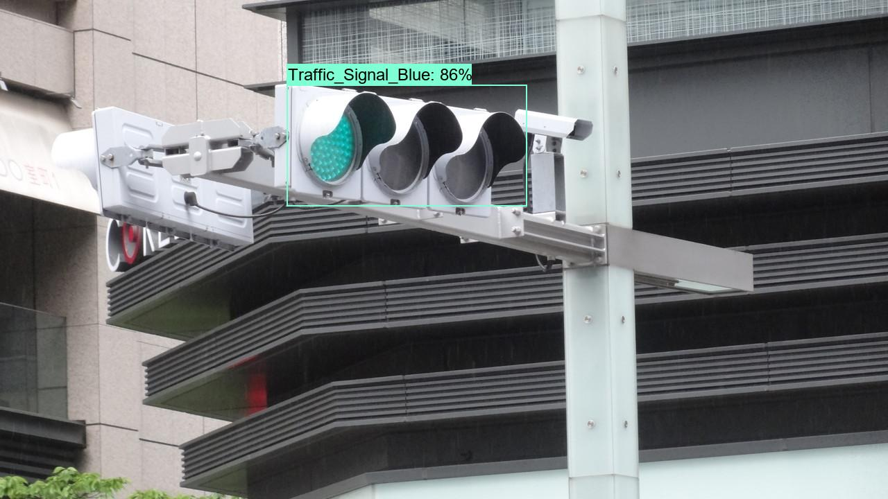 
<a  href="./projects/Signals/test_dataset_outputs/signals_1050.jpg_objects.csv">roadsigns1010.jpg_objects.csv</a> 
 
